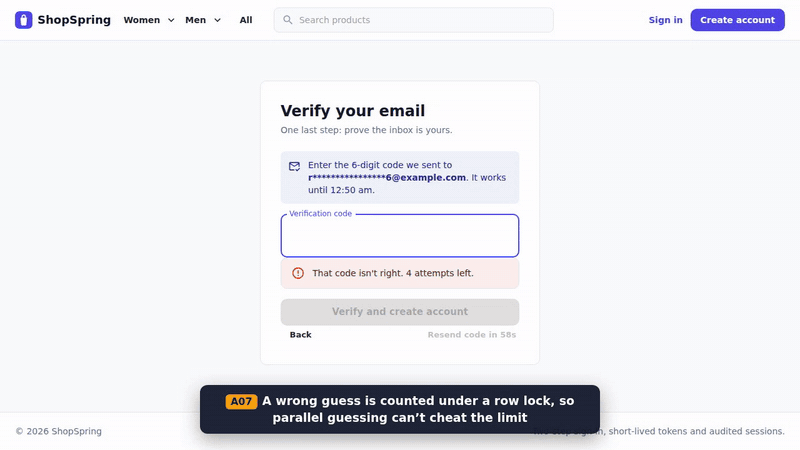
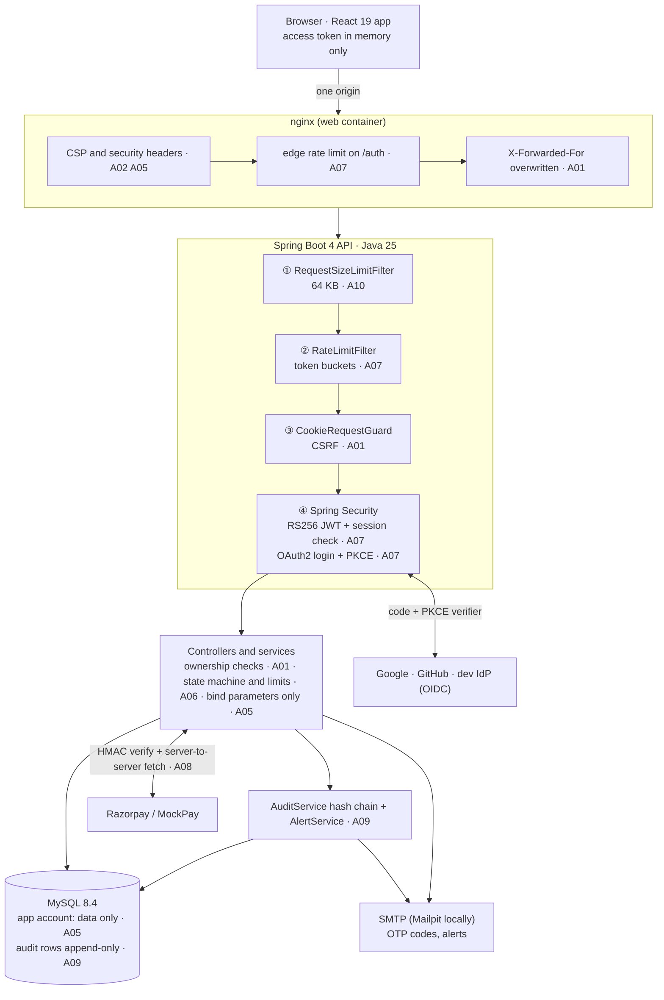
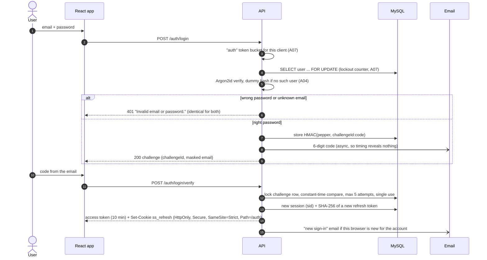
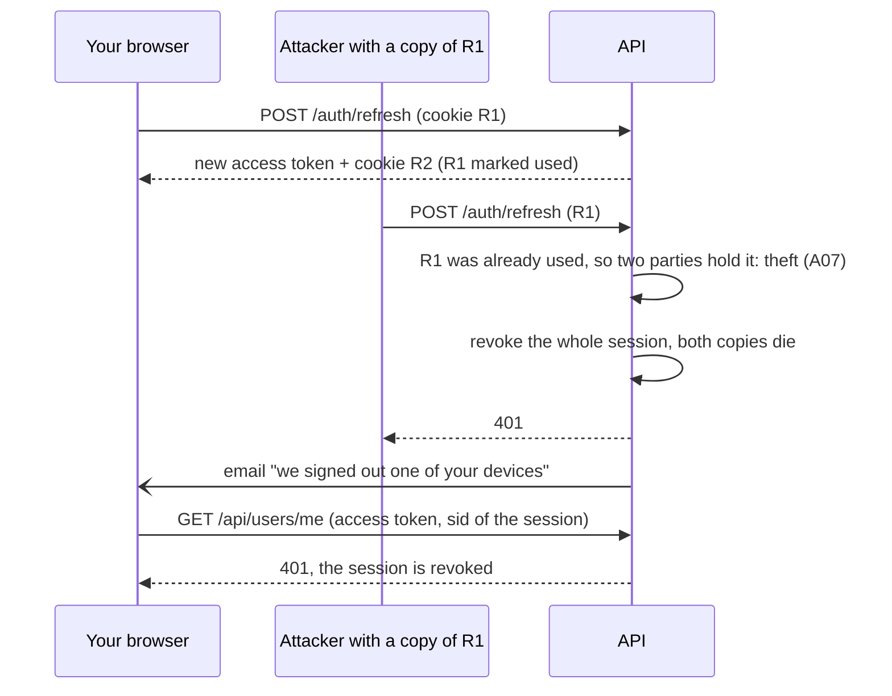
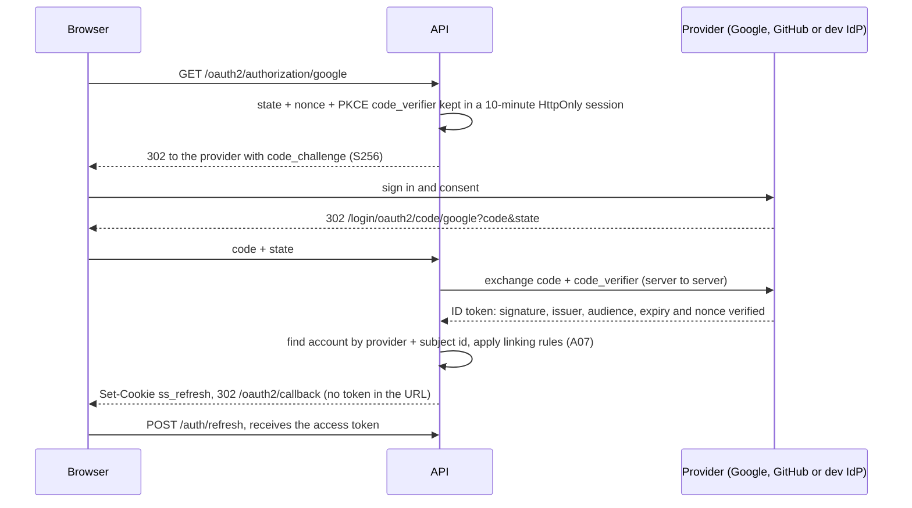
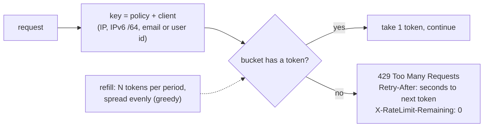
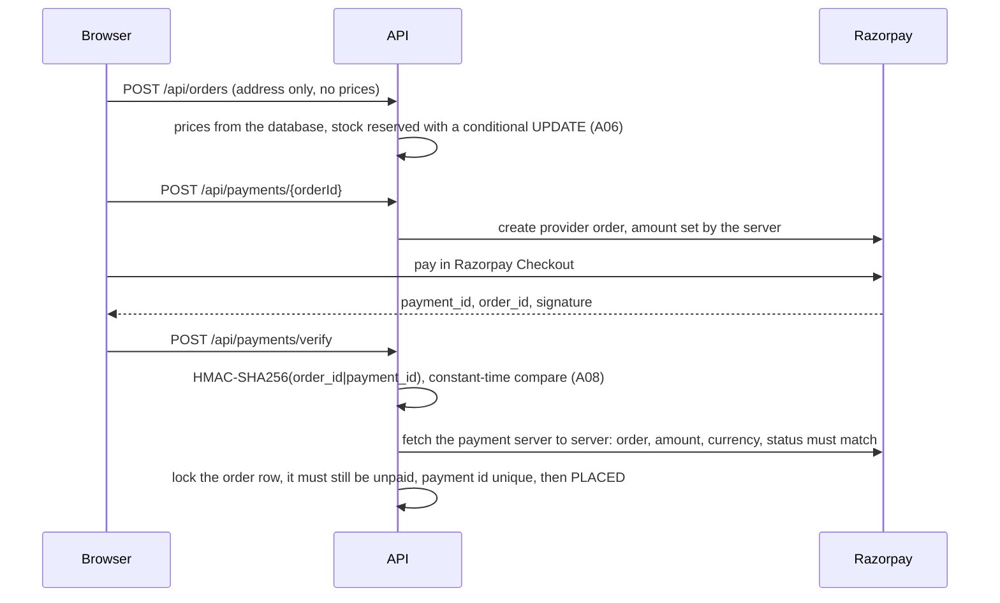
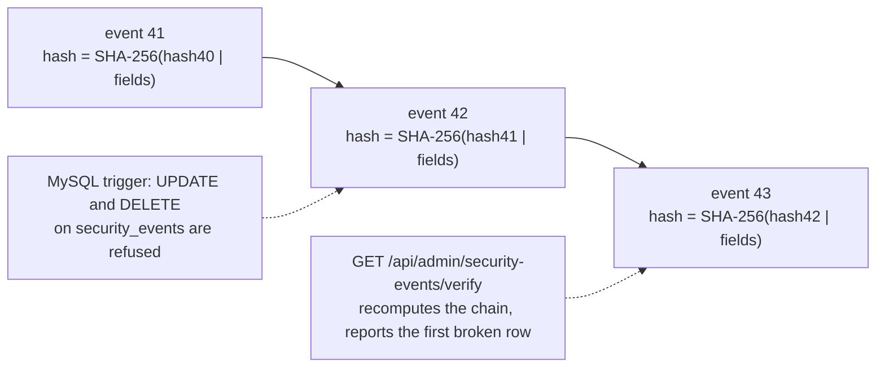

# ShopSpring

A full-stack clothing shop (Spring Boot 4 · React 19 · MySQL 8.4) built around one idea:
**every security control is real, mapped to the OWASP Top 10:2025, and proven by an automated attack test.**

The shop itself is deliberately simple: browse, cart, checkout, pay, review, admin dashboard.
The engineering is in how it is protected: two-step sign-in with emailed one-time codes, OAuth2
login with PKCE, token-bucket rate limiting, rotating refresh tokens with theft detection, a
tamper-evident audit trail, payment signature verification, and a CI pipeline that attacks the
running stack on every push.

[](https://github.com/14harshaldhote/ShopSpring-JWT-React-MySQL/actions/workflows/ci.yml)
[](https://github.com/14harshaldhote/ShopSpring-JWT-React-MySQL/actions/workflows/codeql.yml)

> **How to read the tags.** `A01` to `A10` are the [OWASP Top 10:2025](https://owasp.org/Top10/2025/)
> categories. The same tag appears in this README, in the diagrams, in the Java and nginx source
> (`[OWASP A07:2025]`), and in the test names, so any claim can be followed from the docs to the
> code to the test that proves it.

| | |
|---|---|
| `A01` Broken Access Control | `A06` Insecure Design |
| `A02` Security Misconfiguration | `A07` Authentication Failures |
| `A03` Software Supply Chain Failures | `A08` Software or Data Integrity Failures |
| `A04` Cryptographic Failures | `A09` Security Logging and Alerting Failures |
| `A05` Injection | `A10` Mishandling of Exceptional Conditions |

## Contents

1. [Demo](#demo)
2. [Highlights](#highlights)
3. [Tech stack](#tech-stack)
4. [How the shop works](#how-the-shop-works)
5. [Architecture](#architecture)
6. [The security system in detail](#the-security-system-in-detail)
7. [OWASP Top 10:2025 mapping](#owasp-top-102025-mapping)
8. [OWASP Cheat Sheets applied](#owasp-cheat-sheets-applied)
9. [Proof: the attack test suite](#proof-the-attack-test-suite)
10. [Run it](#run-it)
11. [Project layout](#project-layout)
12. [What changed from v1](#what-changed-from-v1)

## Demo

[](docs/media/shopspring-demo.mp4)

The 2-minute video ([`docs/media/shopspring-demo.mp4`](docs/media/shopspring-demo.mp4)) is
recorded against the Docker Compose stack, with each security control captioned by its OWASP tag:
sign-up with an emailed code and a wrong-code attempt, shopping and paying through the gateway,
the account security page, OAuth2 sign-in with PKCE, a credential-stuffing burst hitting the
token bucket, the admin audit trail and its hash-chain check, and a honeytoken probe that blocks
the client and emails a CRITICAL alert.

## Highlights

| What | Why it matters | Tag |
|---|---|---|
| **Two-step sign-in**: password, then a 6-digit code emailed to the account | A leaked password alone can't sign anyone in | `A07` |
| **OAuth2 / OpenID Connect** with Google, GitHub or a bundled local provider, **PKCE on every request** | Stolen authorization codes are useless; account linking can't be abused for takeover | `A07` |
| **Token-bucket rate limiting** (Bucket4j) per client, per email and per endpoint | Stops credential stuffing, OTP guessing, email bombing and checkout abuse, and says exactly when to retry | `A07` `A06` |
| **Rotating refresh tokens with theft detection** (RFC 9700) | A stolen refresh token works at most once, then the whole session dies and the owner is emailed | `A07` |
| **Revocable 10-minute RS256 access tokens** (RFC 9068) | Sign-out and theft detection cut off the access token immediately, not when it expires | `A07` `A04` |
| **Access token only in memory, refresh token in an HttpOnly SameSite=Strict cookie** | Injected script can't read either token | `A07` `A05` |
| **Tamper-evident audit trail**: hash-chained rows, append-only by database trigger | Editing or deleting history is blocked, and if a DBA forces it, verification points at the exact row | `A09` |
| **Honeytokens** (`/.env`, `/.git/`, `/wp-login.php` ...) | Scanners reveal themselves, get blocked for 15 minutes and trigger an alert email | `A09` |
| **Payment integrity**: server-side amounts, HMAC signature check, server-to-server confirmation, idempotent | A forged, replayed or swapped payment can't mark an order paid | `A08` `A06` |
| **Race-safe stock and lockout counters** (conditional `UPDATE`, row locks) | Two buyers can't both get the last item; parallel password guesses are all counted | `A06` `A07` |
| **Least-privilege database accounts** | Even a successful SQL injection couldn't drop tables or disable the audit trigger | `A05` `A02` |
| **64 attack tests on a real MySQL** plus an end-to-end attack run against the Docker stack in CI | Every claim above is executable | all |
| **Supply chain gate**: SHA-pinned actions, Trivy, CodeQL, CycloneDX SBOMs, Dependabot | The gate already caught and blocked 3 critical Tomcat CVEs during this rebuild | `A03` |

## Tech stack

| Layer | v2 (this rebuild) | v1 |
|---|---|---|
| Language / runtime | **Java 25** (virtual threads) | Java 17 |
| API | **Spring Boot 4.1**, Spring Security 7, Hibernate 7, Jackson 3 | Spring Boot 3.2 |
| Auth | **OAuth2 Resource Server (RS256 JWT)**, OAuth2 Client (PKCE), Argon2id, email OTP | jjwt HS256, BCrypt |
| Rate limiting | **Bucket4j 8** token buckets + Caffeine | none |
| Database | **MySQL 8.4 LTS**, Flyway migrations, `ddl-auto: validate` | MySQL, `ddl-auto: update` |
| Frontend | **React 19**, Vite 8, MUI 9, Tailwind CSS 4, Redux Toolkit 2, React Router 8 | React 18, Vite 5, MUI 5 |
| Payments | Razorpay Orders API + signature verification (mock gateway for local runs) | Razorpay payment links |
| Local OAuth2 provider | **Spring Authorization Server** (`dev-idp/`) | none |
| Delivery | Docker Compose (MySQL, Mailpit, API, IdP, nginx), hardened containers | none |
| Tests | JUnit 5 + **Testcontainers** (MySQL 8.4), Python end-to-end attack run | none |
| CI | GitHub Actions: tests, Trivy, CodeQL, SBOM, Docker e2e, Dependabot | none |

## How the shop works

A shopper browses the catalogue (filters, full-text search, pagination), adds sizes to a cart,
enters an address and pays through Razorpay (or the built-in MockPay gateway locally). Orders
move through `PENDING_PAYMENT → PLACED → CONFIRMED → SHIPPED → DELIVERED`; admins manage
products, orders and users and watch the security event feed. Only customers who bought a
product can review or rate it.

Signing in is always two steps: a password (or Google / GitHub / the local provider), then for
passwords a 6-digit code sent by email. The account page lists every signed-in device, can sign
any of them out, and shows the account's own security history.

## Architecture



PNG versions of every diagram in this README, for slides or posts, are in [`docs/images/`](docs/images/).

The browser only ever talks to one origin. nginx serves the React build and proxies `/api`,
`/auth`, `/oauth2`, `/login/oauth2` and `/.well-known` to the API, so there is no CORS surface in
production and the refresh cookie can be `SameSite=Strict`. The API's management port (8081,
health checks) is never exposed through nginx `A02`.

Every request passes the filters in this order, cheapest first, so a throttled or oversized
request is refused before any JSON parsing, JWT verification or password hashing happens:

| Order | Filter | Refuses with | Tag |
|---|---|---|---|
| -120 | `RequestSizeLimitFilter`: bodies over 64 KB, including chunked bodies with no length | 413 | `A10` |
| -110 | `RateLimitFilter`: `auth`, `refresh` and `api` token buckets per client | 429 + `Retry-After` | `A07` |
| -105 | `CookieRequestGuardFilter`: cross-site calls to the cookie endpoints | 403 | `A01` |
| Security | Honeytoken block list, JWT verification, session revocation, role rules | 401 / 403 | `A07` `A01` `A09` |

## The security system in detail

### 1. Two-step sign-in with emailed one-time codes `A07`



* **Codes**: 6 digits from `SecureRandom`, valid 5 minutes, single use, only the newest code of a
  challenge works. A code is bound to its purpose, so a sign-up code can't finish a login.
* **Storage**: the database holds `HMAC-SHA256(pepper, challengeId:code)`, never the code. A plain
  hash of a 6-digit number could be reversed from a database dump in milliseconds; the pepper
  lives outside the database `A04`.
* **Guessing**: 5 wrong codes burn the challenge. Attempts are counted under a row lock, so
  8 parallel requests can't sneak extra guesses in (tested).
* **Email bombing**: resend has a 60 s cooldown, 3 sends per challenge, and a per-address token
  bucket (5 per hour), so nobody can use the shop to flood a victim's inbox.
* **No account enumeration**: sign-up and password reset always answer `202` with a challenge.
  Signing up with an email that already has an account, or resetting the password of an email
  that has none, returns a decoy challenge of the same shape that never verifies. The real owner
  gets a "someone tried to create an account with your email" note instead of a code. Emails are
  sent asynchronously, so response times don't differ either.
* **Brute force and spraying**: a per-account counter locks password sign-in after 5 failures in
  15 minutes. The lock doubles each time (1, 2, 4 ... minutes, capped at 1 hour) rather than
  being permanent, so an attacker can't lock a victim out for good. The owner is emailed, and a
  password reset by emailed code still works and lifts the lock. The user row is read with
  `SELECT ... FOR UPDATE`, so parallel guesses can't race past the counter.
* **Passwords** follow NIST SP 800-63B and the Authentication Cheat Sheet: 10 to 128 characters,
  any characters, NFKC-normalised, no composition rules; common passwords, passwords built from
  the user's own name or email, and passwords found in breaches (HaveIBeenPwned range API with
  k-anonymity: only 5 hex characters of a SHA-1 prefix leave the server) are refused.
* **Hashing**: Argon2id with m=19 MiB, t=2, p=1 (the Password Storage Cheat Sheet minimum;
  Spring's default of 16 MiB is below it). Older bcrypt or weaker Argon2 hashes are re-hashed
  on the next successful login `A04`.
* Changing or resetting a password signs out every other device and emails the owner.

### 2. Tokens and sessions `A07` `A04`

| Token | Format | Lifetime | Where it lives | Why |
|---|---|---|---|---|
| Access token | JWT, RS256, 3072-bit key, RFC 9068 `at+jwt` | 10 minutes | JavaScript memory only | Never in `localStorage`, so XSS can't steal it from storage |
| Refresh token | 256 random bits, stored as SHA-256 | 7 days, session max 30 days | `HttpOnly; Secure; SameSite=Strict; Path=/auth` cookie | JavaScript can't read it, other sites can't send it, and it only travels to `/auth` |

The verifier is pinned to RS256 and never trusts the token header, so `alg: none` and the
RS256-to-HS256 key confusion attack fail. It checks `typ`, `iss`, `aud`, `client_id`, `exp`,
`iat`, `sub` and `jti`, so an ID token or a token for another API is refused. The public key is
published at `/.well-known/jwks.json`; the private key comes from the environment
(`JWT_PRIVATE_KEY`) and the production profile refuses to start without it `A02`.

Every access token carries a `sid` claim naming its server-side session. Each request checks
that the session is still active (cached for 30 seconds, and immediately on the instance that
revoked it), so signing out, "sign out other devices", a password change or a detected theft
kills the access token at once.

**Refresh token rotation with reuse detection** (OAuth 2.0 Security BCP, RFC 9700 §4.14.2):



We can't tell which holder is the thief, so both lose the session and the real owner signs in
again with password + code. One exception keeps real users from being signed out by their own
browser: two tabs refreshing at the same moment send the same token. A reuse within 2 seconds
from the same IP and browser gets a harmless `409` (retry; the browser already has the new
cookie) and never a token, so a thief gains nothing from it.

Refresh token lookups use `SELECT ... FOR UPDATE`, so two concurrent refreshes with the same
token can't both succeed (time-of-check to time-of-use, CWE-367).

### 3. OAuth2 and OpenID Connect with PKCE `A07`



* **PKCE on every client**, including confidential ones, as OAuth 2.1 and RFC 9700 require, so an
  intercepted authorization code can't be redeemed.
* **No tokens in URLs**: after the callback the API sets the refresh cookie and redirects to a
  bare `/oauth2/callback`; the app then calls `/auth/refresh`. Nothing leaks through browser
  history, `Referer` or logs.
* **Account linking rules** (`OAuth2AccountService`):
  1. A returning user is found by provider + **subject id**, which never changes, not by email.
  2. A provider account whose email isn't verified is refused, so nobody can add
     `victim@example.com` at some provider and take over the victim's shop account.
  3. Linking to an existing verified account emails the owner.
  4. **Pre-account hijacking**: if an unverified account already exists with that email, its
     password was set by someone who never proved the mailbox, possibly an attacker who
     registered the victim's address in advance. The password is wiped before linking, so the
     attacker's password stops working (tested).
* GitHub has no OpenID Connect, so the verified primary email is read from `/user/emails`.
* Providers are registered only when their credentials are in the environment; unknown provider
  ids fall through to a normal 404 instead of an error page.
* `dev-idp/` is a small Spring Authorization Server so the whole flow runs locally and in CI
  without real Google credentials.

### 4. Token-bucket rate limiting `A07` `A06` `A01`



Each bucket holds `capacity` tokens and refills continuously. Bursts up to the capacity are
allowed; sustained abuse is held to the refill rate. Unlike a fixed window, there is no boundary
where a client can fire twice the limit, and the response says exactly when to retry.

| Bucket | Key | Capacity / refill | Stops |
|---|---|---|---|
| `auth` | client IP | 10 per minute | credential stuffing, password spraying, sign-up spam |
| `refresh` | client IP | 30 per minute | refresh token guessing and hammering |
| `api` | client IP | 120 per minute | scraping and general abuse |
| `otp-email` | email address | 5 per hour | email bombing a victim through the shop |
| `checkout` | user | 5 per 10 minutes | holding stock hostage with fake checkouts |
| `alert-mail` | global | 20 per hour | an attack turning into an alert-email flood |

* IPv6 clients are bucketed per `/64`, since one user typically controls a whole /64 and could
  otherwise get a fresh bucket per address (unit tested).
* The client IP is the socket address. Tomcat's `RemoteIpValve` only accepts `X-Forwarded-For`
  from the internal proxy, and nginx overwrites that header, so a client can't spoof its IP to
  reset its buckets `A01`.
* Buckets live in a size-bounded Caffeine cache, so random keys can't exhaust memory. For several
  API instances, Bucket4j's Redis or JDBC proxy manager drops in behind the same interface.
* nginx adds a coarse edge limit (30 requests per minute, burst 20) on the endpoints where a
  password or code can be guessed: sign-in, sign-up, one-time codes and password reset. Session
  refresh is left to the API's `refresh` bucket, because a browser refreshes on every page load
  and an edge limit there would sign out a user who opens a few tabs. The browser end-to-end test
  caught exactly that, and the web app now waits out a `429` on refresh instead of signing out.

### 5. Access control `A01`

* Deny by default: every route not explicitly public requires a valid access token, and
  `/api/admin/**` requires the `ADMIN` role. A test walks a matrix of anonymous, customer and
  admin requests across the routes and checks each status code.
* **IDOR**: every query for a user's data includes the user id (`findByIdAndUserId`), so another
  user's order, cart line, session or address answers `404`, not `403`, and reveals nothing.
* **Mass assignment**: request bodies are Java records with only the fields a client may set.
  `role`, `emailVerified`, prices and totals sent by a client are ignored (tested).
* **CSRF**: the only cookie-authenticated endpoints are under `/auth`. They need
  `SameSite=Strict`, a custom `X-Requested-With` header (which forms can't send and cross-origin
  scripts can't send without passing CORS), and a same-site `Sec-Fetch-Site` / `Origin`. Any one
  of the three stops a cross-site request.
* CORS allows only the configured origins; a foreign origin gets no `Access-Control-Allow-Origin`.

### 6. Injection `A05`

* Every query is parameterised: JPQL, Criteria API, and native SQL with bind variables, including
  the MySQL full-text search. No request value is ever concatenated into SQL.
* Sorting and filtering go through allowlists that map to fixed columns, so `ORDER BY` injection
  is impossible; anything else is refused with `400`.
* Full-text boolean operators (`+ - < > ( ) ~ * " @`) are stripped from search terms, so a user
  can't change the meaning of the search or trigger a syntax error.
* Input validation with Bean Validation on every DTO (lengths, ranges, patterns); control
  characters are stripped from reviews.
* XSS: the API returns JSON only, with `Content-Security-Policy: default-src 'none'` and
  `nosniff`. React escapes text by default, and the web app's CSP has no `'unsafe-inline'` or
  `'unsafe-eval'` in `script-src`, so injected markup can't run script even if it got through.
* Least privilege: the app's MySQL account has `SELECT, INSERT, UPDATE, DELETE` only. Schema
  changes run under a separate migration account used only by Flyway at startup, so even a
  successful injection could not `DROP`, `ALTER`, read server files or disable triggers `A02`.

### 7. Payments and business logic `A08` `A06`



* The client never sends a price. The amount is computed from the database and fixed at the
  provider when the provider order is created.
* A forged signature, or a real signature for a different order, is refused and recorded as a
  `CRITICAL` event. Replaying a success is a no-op (idempotent). Webhooks are HMAC-verified too.
* **Stock**: `UPDATE ... SET stock = stock - ? WHERE id = ? AND stock >= ?` either reserves or
  fails atomically. Two buyers racing for the last item get exactly one order (tested).
* Unpaid orders expire after 30 minutes and return their stock; a payment that arrives after
  expiry is refunded, not accepted. A customer can hold at most 3 unpaid orders.
* Orders follow an explicit state machine; an unpaid order can't be shipped, a delivered one
  can't be cancelled. Cart lines are capped (10 units, 20 lines).

### 8. Audit trail, alerting and honeytokens `A09`



* Every security event (sign-ins, failures, lockouts, OTP failures, token reuse, password
  changes, access denials, payment mismatches, admin actions) is written with who, what, when,
  where and outcome, to both the `SECURITY_AUDIT` log and the `security_events` table.
* Audit writes run in their own transaction, so a failed login that rolls back still leaves its
  record, and an audit failure never breaks the request.
* **Append-only**: a database trigger (Flyway `V2`) refuses `UPDATE` and `DELETE` on the table.
* **Tamper-evident**: rows are hash-chained. If someone with more privileges drops the trigger
  and edits a row, `/verify` names the first broken row (tested exactly that way).
* Nothing secret is logged: no passwords, codes or tokens; emails are masked in log lines, and
  CR/LF are stripped from untrusted values so a crafted `User-Agent` can't forge log entries
  (CWE-117).
* `HIGH` and `CRITICAL` events (token theft, lockouts, forged payments, honeytoken hits) email
  the security mailbox in real time, throttled by their own token bucket.
* **Honeytokens**: `/.env`, `/.git/`, `/wp-login.php`, `/wp-admin/`, `/phpmyadmin/`,
  `/actuator/env`, `/actuator/heapdump`, and `/api/internal/backup` (advertised as `Disallow` in
  `robots.txt`, which scanners read as a map of interesting places) are never requested by real
  users. A hit is recorded as
  `CRITICAL`, the client is blocked for 15 minutes, and it gets an ordinary `404` so it learns
  nothing.
* Users see their own recent security activity on the account page; admins see the full feed.

### 9. Configuration, errors and deployment `A02` `A10`

* **Security headers** on every API response: `Cache-Control: no-store`, `Content-Security-Policy:
  default-src 'none'; frame-ancestors 'none'`, `X-Content-Type-Options: nosniff`,
  `X-Frame-Options: DENY`, `Referrer-Policy: no-referrer`, HSTS, `Permissions-Policy`. The web app
  gets its own CSP from nginx.
* **Errors** are RFC 9457 problem responses. Unexpected errors return a random error id that also
  appears in the server log, never a stack trace, SQL or class name (CWE-209). Malformed JSON,
  wrong types, 405, 406 and 415 all get clean 4xx answers (tested).
* **Fail fast**: the `prod` profile refuses to start with a missing secret, the mock payment
  gateway, or API docs switched on. Locally, missing secrets are generated at startup.
* **No secrets in git**: everything comes from the environment. `scripts/init-env.sh` generates a
  fresh `.env` (random database passwords, a new RSA key, OTP pepper) that is git-ignored.
* **Containers**: multi-stage builds, non-root users, read-only root filesystems, all Linux
  capabilities dropped, `no-new-privileges`, ports bound to `127.0.0.1` only.

### 10. Supply chain `A03`

* GitHub Actions are pinned to full commit SHAs (a tag can be moved to malicious code, as in the
  tj-actions/changed-files compromise of March 2025); the workflow token is read-only.
* **Trivy** fails the build on any critical or high CVE with a fix in the Maven and npm
  dependency trees, on secrets in the repository, and on Dockerfile misconfigurations. It scans
  the built images too. During this rebuild it caught three critical CVEs in the Tomcat bundled
  with Spring Boot 4.1.1 (CVE-2026-65182, CVE-2026-65905, CVE-2026-68525); Tomcat is pinned to the
  fixed 11.0.26 in both `pom.xml` files until Boot ships it. On the first CI run of this PR it
  caught a newly listed Jackson CVE (CVE-2026-68497, CPU denial of service through
  unbounded number parsing), so Jackson is pinned to the fixed 3.1.7 and 2.21.7 the same way.
* **CodeQL** with the `security-extended` queries on Java and JavaScript, on every push and weekly.
  Its first run flagged CSRF protection switched off in three filter chains. Two of them only serve
  GET redirects and docs, so Spring's CSRF filter is back on there. The third is the bearer-token
  API, where CSRF can't apply; its one cookie has its own CSRF defences (section 5), proven by
  `SecurityConfigurationTest`. CodeQL also flags SHA-1 in the breached-password check: the Pwned
  Passwords API is keyed by SHA-1, and it is a lookup key, not password storage (that is Argon2id).
  Those two are triaged as won't-fix with this reasoning in the code, not excluded from the scan.
* **CycloneDX SBOMs** for the API and the web app are attached to every CI run.
* **Dependabot** keeps Maven, npm, Docker base images and the pinned action SHAs up to date; each
  update has to pass the whole gate.

## OWASP Top 10:2025 mapping

| # | Category | What ShopSpring does | Main code | Proven by |
|---|---|---|---|---|
| A01 | Broken Access Control | Deny by default, role rules, owner-scoped queries (IDOR → 404), record DTOs against mass assignment, CSRF guard, strict CORS, IP from trusted proxy only | `SecurityConfig`, `OrderRepository`, `CookieRequestGuardFilter`, `ClientInfo` | `AccessControlTest`, `SecurityConfigurationTest` |
| A02 | Security Misconfiguration | Header set, CSP, no stack traces, prod fail-fast, secrets from env, hidden management port, hardened containers, least-privilege DB | `SecurityConfig`, `StartupSecurityValidator`, `nginx/`, `docker-compose.yml`, `docker/mysql/` | `SecurityConfigurationTest` |
| A03 | Software Supply Chain Failures | SHA-pinned actions, Trivy, CodeQL, SBOMs, Dependabot, patched Tomcat | `.github/` | CI |
| A04 | Cryptographic Failures | Argon2id (OWASP parameters), RS256 3072-bit, HMAC-peppered OTPs, hashed refresh tokens, `SecureRandom`, constant-time compares | `PasswordConfig`, `JwtConfig`, `OtpService`, `Hmac` | `SecurityUnitTest`, `TokenAttackTest` |
| A05 | Injection | Parameterised queries, sort/filter allowlists, full-text operator stripping, validation, CSP, JSON-only API | `ProductRepository`, `ProductFilter`, `ProductService` | `InjectionTest` |
| A06 | Insecure Design | Order state machine, atomic stock reservation, cart and unpaid-order limits, verified-buyer reviews, checkout bucket, expiry of unpaid orders | `OrderStatus`, `OrderService`, `CartService`, `ReviewService` | `PaymentIntegrityTest`, `AccessControlTest` |
| A07 | Authentication Failures | Email OTP, lockout, token buckets, NIST passwords + breach check, rotating refresh tokens with theft detection, revocable RFC 9068 access tokens, OAuth2 + PKCE, safe account linking | `auth/`, `security/`, `oauth2/` | `AuthenticationAttackTest`, `TokenAttackTest`, `OAuth2AccountLinkingTest` |
| A08 | Software or Data Integrity Failures | Algorithm-pinned JWT verification, payment and webhook HMAC, server-to-server payment confirmation, idempotent verify | `JwtConfig`, `PaymentService`, `RazorpayGateway` | `TokenAttackTest`, `PaymentIntegrityTest` |
| A09 | Security Logging and Alerting Failures | Hash-chained append-only audit trail, real-time alert emails, honeytokens, log-injection-safe logging, user-visible activity | `audit/`, `HoneypotController`, `LogSanitizer` | `AuditTrailTest` |
| A10 | Mishandling of Exceptional Conditions | One exception handler with RFC 9457 responses and error ids, size limits, connect and read timeouts on outbound HTTP and SMTP, audit that never breaks a request, deliberate fail-open only for the breach check | `GlobalExceptionHandler`, `RequestSizeLimitFilter`, `BreachedPasswordChecker` | `InjectionTest` |

## OWASP Cheat Sheets applied

**[Authentication](https://cheatsheetseries.owasp.org/cheatsheets/Authentication_Cheat_Sheet.html)**
Generic error messages for wrong password and unknown email, with equal response time (dummy
Argon2 hash). Identical answers from sign-up and password reset. Account lockout with an
exponential, capped duration instead of a permanent lock. MFA on every password sign-in. Length
over complexity, breached-password check, no truncation. Re-authentication (current password) to
change the password, then every other session is revoked. Owners are notified of new devices,
lockouts, linked providers and password changes.

**[SQL Injection Prevention](https://cheatsheetseries.owasp.org/cheatsheets/SQL_Injection_Prevention_Cheat_Sheet.html)**
Option 1 (prepared statements) everywhere, including native full-text queries. Option 3
(allowlist input validation) for the parts SQL can't bind, such as sort columns and directions.
Least privilege as the extra defence: the runtime account can't change the schema.

**[REST Security](https://cheatsheetseries.owasp.org/cheatsheets/REST_Security_Cheat_Sheet.html)**
HTTPS-only cookies and HSTS. Access control on every endpoint. JWTs with a pinned algorithm and
full claim validation, never `alg: none`. Input validation on types, lengths and ranges, with
request size limits. `Content-Type` enforced (415 otherwise). The recommended response headers
(`Cache-Control: no-store`, CSP, `nosniff`, `X-Frame-Options`). Sensitive data never in URLs.
Proper status codes, including 429 with `Retry-After`. Error responses without internals.

**[Logging](https://cheatsheetseries.owasp.org/cheatsheets/Logging_Cheat_Sheet.html)**
Which events: authentication successes and failures, authorization failures, session
management, input validation failures, admin actions, payment mismatches. What to record: when,
where (IP, user agent, request), who (user id) and outcome. What never to record: passwords,
codes, tokens, full emails in logs. Protection: log-injection neutralisation, append-only
storage, tamper detection, and alerting on high-severity events.

## Proof: the attack test suite

`shopeefy-server/src/test/java/com/shopeefy/attacks/` runs real attacks against the real
application and a real MySQL 8.4 (Testcontainers). Nothing security-related is mocked.

| Test class | Attacks | Tag |
|---|---|---|
| `AuthenticationAttackTest` | brute force and lockout, parallel guessing race, credential stuffing throttling, OTP email bombing, account enumeration (login, sign-up, reset), OTP brute force, OTP replay, OTP race with 8 threads, cross-purpose OTP, weak passwords, reset while locked | `A07` |
| `TokenAttackTest` | `alg: none`, RS256→HS256 key confusion, edited payload, attacker's own key with the same `kid`, wrong audience/issuer/type, expired token, stolen refresh token reuse, two-tab race, logout, remote device sign-out | `A07` `A08` |
| `OAuth2AccountLinkingTest` | unverified provider email, pre-account hijacking, subject vs email, owner notification | `A07` |
| `AccessControlTest` | full role matrix, IDOR on orders, cart lines, sessions and addresses, mass assignment, business limits | `A01` |
| `InjectionTest` | SQL injection in search, filters and sort, full-text operator abuse, stored XSS, fake reviews, malformed and oversized requests | `A05` `A10` |
| `PaymentIntegrityTest` | client-set amounts, forged and swapped signatures, replay, declined payments, webhook forgery, last-item race, expiry and late payment refund, state machine, unpaid-order limit | `A08` `A06` |
| `SecurityConfigurationTest` | headers, cookie flags, CSRF, CORS, JWKS without private material, OAuth2 misconfiguration | `A02` |
| `AuditTrailTest` | honeytoken alert and block, app account can't edit audit rows, hash chain catches a DBA edit, no secrets in events, user activity | `A09` |
| `SecurityUnitTest` | token bucket math, exponential lockout, IPv6 /64 bucketing, log sanitiser, constant-time HMAC, state machine, Argon2 parameters | all |

```bash
cd shopeefy-server
./mvnw verify            # needs Docker for Testcontainers; 64 tests
```

`scripts/smoke_test.py` then attacks the running Docker stack end to end (through nginx, with
real emails in Mailpit and a real OAuth2 + PKCE login against the dev IdP). CI runs both on
every push.

## Run it

**Everything in Docker** (needs Docker and OpenSSL):

```bash
./scripts/init-env.sh            # writes .env with fresh random secrets and prints the logins
docker compose up --build        # MySQL, Mailpit, API, dev IdP, nginx
```

| URL | What |
|---|---|
| http://localhost:8088 | the shop |
| http://localhost:8025 | Mailpit: every OTP code and alert email lands here |
| http://localhost:9000 | local OpenID Connect provider for "Sign in with Dev IdP" |

Sign in as the admin with the credentials `init-env.sh` printed, or register a customer and
read the code from Mailpit. Payments use MockPay locally; set `PAYMENT_PROVIDER=razorpay` and the
`RAZORPAY_*` keys in `.env` for Razorpay test mode, and `GOOGLE_*` / `GITHUB_*` to enable those
providers.

```bash
python3 scripts/smoke_test.py    # attack the running stack (add DEVIDP_USER_PASSWORD from .env for OAuth2)
```

**Without Docker for the apps** (Java 25, Node 22, a MySQL 8.4 and an SMTP catcher on 1025):

```bash
cd shopeefy-server && ./mvnw spring-boot:run      # API on :8080, generates dev secrets itself
cd shopeefy-vite && npm ci && npm run dev         # web on :5173, proxies the API
```

The OpenAPI UI is at http://localhost:8080/swagger-ui.html when the API runs directly (it is
switched off in the `prod` profile).

## Project layout

```
shopeefy-server/      Spring Boot API
  src/main/java/com/shopeefy/
    auth/             sign-up, sign-in, OTP, sessions, refresh rotation          A07 A04
    oauth2/           OAuth2/OIDC providers and account linking                  A07
    security/         filter chains, JWT, token buckets, CSRF guard, honeytokens A01 A07 A09
    audit/            hash-chained audit trail and alerts                        A09
    catalog/ cart/ order/ payment/ review/   the shop                            A05 A06 A08
    common/ config/   errors, log sanitising, secrets, prod fail-fast            A02 A10
  src/main/resources/db/migration/   Flyway: schema, append-only audit trigger
  src/test/java/com/shopeefy/attacks/  the attack suite
shopeefy-vite/        React 19 app, nginx config with CSP and edge limits
dev-idp/              local OpenID Connect provider (Spring Authorization Server)
docker/mysql/         least-privilege database accounts
scripts/              init-env.sh (secrets), smoke_test.py (end-to-end attacks)
docs/                 API reference, threat model, diagrams
.github/              CI, CodeQL, Dependabot
```

More detail: [`docs/API.md`](docs/API.md) (every endpoint) and
[`docs/THREAT_MODEL.md`](docs/THREAT_MODEL.md) (assets, trust boundaries, threats and their
mitigations).

## What changed from v1

| Area | v1 | v2 |
|---|---|---|
| Token signing | HS256 with the secret hard-coded in `JwtConstant.java` | RS256 key from the environment, RFC 9068 claims, algorithm pinned |
| Token storage | JWT in `localStorage`, readable by any injected script | access token in memory, refresh token in an HttpOnly SameSite=Strict cookie |
| Sessions | a JWT valid until it expired, no sign-out | 10-minute tokens tied to revocable sessions, rotation with theft detection |
| Sign-in | password only | password + email OTP, or OAuth2 with PKCE |
| Brute force | unlimited attempts | token buckets + per-account exponential lockout |
| Payments | any captured `payment_id` could mark any `order_id` as paid | signature + server-side amount/order match + row lock + idempotency |
| Database | `root` account, schema changed by Hibernate at runtime | data-only app account, Flyway migrations under a separate account |
| Secrets | database password and Razorpay keys committed | none in git; generated per environment |
| CSRF / CORS | CSRF off, CORS allowed every method and header | CSRF guard on cookie endpoints, origin allowlist |
| Logging | `System.out.println` of payment objects | hash-chained audit trail, alerts, sanitised logs |
| Tests / CI | none | 64 attack tests, end-to-end attack run, Trivy, CodeQL, SBOMs |
