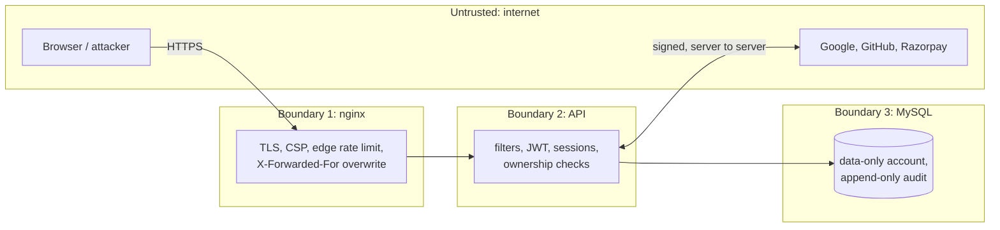

# ShopSpring threat model

A STRIDE pass over the v2 design. Each threat names the control that answers it, the OWASP
Top 10:2025 category, and the test that proves the control works. The last section lists what
is deliberately **not** covered, so nobody mistakes the limits for guarantees.

## Assets

| Asset | Why an attacker wants it |
|---|---|
| Customer accounts and sessions | order in someone else's name, read addresses and order history |
| Admin account | change prices and stock, read every customer's data |
| Payment state of orders | get goods without paying |
| Stock levels | hold inventory hostage, oversell |
| Signing key, OTP pepper, payment secrets | forge tokens, codes or payment confirmations |
| Audit trail | erase evidence of an attack |

## Trust boundaries

Everything left of the API is untrusted input, including headers, cookies, provider redirects and
payment callbacks. Only the socket address of nginx and the server-to-server answers from
providers are trusted, and the latter only after signature and field checks.

## Threats and mitigations

| STRIDE | Threat | Mitigation | OWASP | Test |
|---|---|---|---|---|
| Spoofing | Credential stuffing / password spraying | `auth` token bucket per IP (IPv6 per /64), per-account exponential lockout, email OTP on every password sign-in, breached-password check | A07 | `AuthenticationAttackTest` |
| Spoofing | Guessing the 6-digit code | 5 attempts per challenge counted under a row lock, 5-minute lifetime, single use | A07 | `AuthenticationAttackTest` (brute force, race) |
| Spoofing | Forged access token (`alg: none`, HS256 with the public key, own key with same `kid`) | verifier pinned to RS256 and our key, full RFC 9068 claim checks | A07 A08 | `TokenAttackTest` |
| Spoofing | Stolen refresh cookie | rotation with reuse detection revokes the session and emails the owner; cookie is HttpOnly, SameSite=Strict, Path=/auth | A07 | `TokenAttackTest` |
| Spoofing | Account takeover through social login (unverified provider email, pre-registered account) | verified email required, link by subject id, password wiped on unverified accounts, owner notified | A07 | `OAuth2AccountLinkingTest` |
| Spoofing | Intercepted authorization code | PKCE S256 on every client, `state` and `nonce` checked | A07 | `smoke_test.py` (OAuth2 section) |
| Spoofing | Spoofed client IP to reset rate limits | `RemoteIpValve` trusts only the internal proxy; nginx overwrites `X-Forwarded-For` | A01 | configuration (`shopspring.conf`, `ClientInfo`) |
| Tampering | Changing prices or totals from the client | records without price fields; amounts from the database and fixed at the provider | A06 A01 | `AccessControlTest`, `PaymentIntegrityTest` |
| Tampering | Forged or swapped payment confirmation | HMAC signature, server-to-server fetch with order/amount/currency match, unique payment id | A08 | `PaymentIntegrityTest` |
| Tampering | SQL injection | bind parameters everywhere, allowlisted sort/filter, full-text operators stripped, data-only DB account | A05 | `InjectionTest` |
| Tampering | Editing audit history | trigger blocks `UPDATE`/`DELETE`; hash chain exposes edits made after dropping the trigger | A09 | `AuditTrailTest` |
| Tampering | Cross-site request to cookie endpoints | SameSite=Strict + required custom header + Fetch Metadata / Origin check | A01 | `SecurityConfigurationTest` |
| Repudiation | "I never signed in / paid / changed that" | hash-chained events with user, IP, user agent, request and outcome; users see their own activity | A09 | `AuditTrailTest` |
| Information disclosure | Reading other users' orders, addresses, sessions (IDOR) | every query scoped by user id, `404` for foreign ids | A01 | `AccessControlTest` |
| Information disclosure | Account enumeration | identical login errors and timing (dummy hash), decoy OTP challenges for sign-up and reset, async email | A07 | `AuthenticationAttackTest` |
| Information disclosure | Stack traces, SQL or versions in errors | RFC 9457 responses with an error id only; `server_tokens off` | A10 A02 | `InjectionTest` |
| Information disclosure | Token theft through XSS | access token in memory only, refresh token HttpOnly, CSP without inline script, JSON API with `default-src 'none'` | A05 A07 | `InjectionTest`, `SecurityConfigurationTest` |
| Information disclosure | Secrets in the repository or logs | env-only secrets, `init-env.sh`, prod fail-fast, Trivy secret scan, no codes/tokens/passwords in logs | A02 A09 | `AuditTrailTest`, CI |
| Denial of service | Request floods and slow bodies | nginx body/header timeouts, 64 KB body cap (also for chunked bodies), token buckets before any expensive work | A10 A07 | `InjectionTest` (oversized), `SecurityUnitTest` |
| Denial of service | Locking a victim out on purpose | lockout is temporary and capped at 1 hour; reset by emailed code still works and lifts it | A07 | `AuthenticationAttackTest` |
| Denial of service | Email bombing through OTP resend | 60 s cooldown, 3 sends per challenge, `otp-email` bucket 5 per hour per address | A06 | `AuthenticationAttackTest` |
| Denial of service | Holding stock with unpaid checkouts | max 3 unpaid orders, `checkout` bucket, 30-minute expiry releases stock | A06 | `PaymentIntegrityTest` |
| Denial of service | Overselling the last item under concurrency | conditional `UPDATE ... WHERE quantity >= ?` | A06 | `PaymentIntegrityTest` |
| Elevation of privilege | Becoming admin via mass assignment or token edit | role never read from requests; role comes from the signed token issued by the server | A01 | `AccessControlTest`, `TokenAttackTest` |
| Elevation of privilege | SQL injection escalating to schema changes | runtime DB account has DML only | A05 A02 | `AuditTrailTest` (app account can't edit audit rows) |
| Elevation of privilege | Compromised dependency or CI action | SHA-pinned actions, read-only token, Trivy, CodeQL, SBOMs, Dependabot | A03 | CI |

## Known limits and residual risk

* **Email OTP is only as strong as the mailbox.** An attacker who controls the victim's email and
  knows the password can sign in. WebAuthn/passkeys would be the next step.
* **Rate-limit buckets and the honeytoken block list live in memory per instance.** With several
  API instances they should move to Redis (Bucket4j proxy manager) so limits are shared.
* **The breached-password check fails open** when HaveIBeenPwned is unreachable, by design; the
  length and common-password rules still apply.
* **The session revocation cache** lets an access token live up to 30 seconds after a revocation
  made on a different instance. On the instance that revoked it, the cut-off is immediate.
* **TLS is terminated in front of nginx** in production (a load balancer or a TLS server block);
  the local compose stack runs on plain HTTP on `127.0.0.1` only.
* **`dev-idp` and MockPay are development tools.** The `prod` profile refuses to start with the
  mock gateway, and the dev IdP is not part of a production deployment.
* **Tokens in memory are lost on reload by design**; the app silently refreshes with the cookie,
  so this costs one request, not a sign-in.
